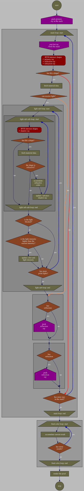

# Webgl Raytracer

---

## Online Demo Link

**`/!\ important /!\`**

http://guillaumebouchetepitech.github.io/webgl_raytracer/index.html

**`/!\ important /!\`**

---

## Description

Real time Ray Tracer running on the GPU using WebGL2
* It works best on desktops/laptops (as opposed to smartphones)
* Chromium based web browsers behave the best so far (Chrome, Brave, Chromium...)
* The canvas can be clicked to use the free fly camera controls
* The resolution will be automatically scaled down in case of performance issues

## Physic Engine Used

"FrankenPhys", follow that [link](https://github.com/GuillaumeBouchetEpitech/FrankenPhys).

## How To Run

First start the file server

```bash
node dumbFileServer.js 16000 0.0.0.0
```

Then open that link: http://localhost:16000/index.html

## How To Build

Tested with: node@22 + npm@10

```bash
# only once
npm install
```

```bash
# watch for changes
# ---> nodemon, typescript + shader files
# and build debug version
# ---> bun.js fast debug build with inlined sourcemap (~0.1s)
# ---> type safety is NOT applied
npm run watch
```

```bash
# build release version
# ---> rollup.js build with minification passes and comments removal (~4.5s)
# ---> type safety is applied
npm run release
```

```bash
# build debug version
# ---> rollup.js build with inlined sourcemap (~3.5s)
# ---> type safety is applied
npm run debug
```

## Main data texture description

* **Dimensions:** 2048 x 6? (<- the texture height is dynamic, as in "on demand")
* **Type:** 2D texture
* **Format:** RGBA32F

Example of "table-cell" / "data-texture-pixel" (vec4 f32):
```
*---------------*
| R | G | B | A |
*---------------*
```

The data texture "static data" rows:

| row index | row type           |
|-----------|--------------------|
|         0 | point lights       |
|         1 | ??? (experimental) |

The data texture "main scene" rows:

| row offset | row index | row type           |
|------------|-----------|--------------------|
|          0 |     2 + 0 | materials          |
|          1 |     2 + 1 | bvh tree nodes     |
|          2 |     2 + 2 | sphere shapes      |
|          3 |     2 + 3 | box shapes         |
|          4 |     2 + 4 | triangle shapes    |
|          5 |     2 + 5 | sub scenes         |

The data texture "sub scene(s)" rows:

| row offset | row index                     | row type            |
|------------|-------------------------------|---------------------|
|          0 |     2 + {scene_index} x 6 + 0 | materials           |
|          1 |     2 + {scene_index} x 6 + 1 | bvh tree nodes      |
|          2 |     2 + {scene_index} x 6 + 2 | sphere shapes       |
|          3 |     2 + {scene_index} x 6 + 3 | box shapes          |
|          4 |     2 + {scene_index} x 6 + 4 | triangle shapes     |
|          5 |     2 + {scene_index} x 6 + 5 | sub scenes (unused) |

Material row values (row index: 0)
```
2 x vec4f
basic-material-texel[0]:R: material type (0=basic)
basic-material-texel[0]:G: can cast shadows (0 or 1)
basic-material-texel[0]:B: reflection index [0..1]
basic-material-texel[0]:A: refraction index [0..1]
basic-material-texel[1]:R: can receive light
basic-material-texel[1]:G: color.r
basic-material-texel[1]:B: color.g
basic-material-texel[1]:A: color.b

2 x vec4f
chessboard-material-texel[0]:R: material type (1=chessboard)
chessboard-material-texel[0]:G: can cast shadows (0 or 1)
chessboard-material-texel[0]:B: sub material index A (basic-material index)
chessboard-material-texel[0]:A: sub material index B (basic-material index)
chessboard-material-texel[1]:R: chessboard-fraction.x
chessboard-material-texel[1]:G: chessboard-fraction.y
chessboard-material-texel[1]:B: chessboard-fraction.z
chessboard-material-texel[1]:A: <unused>
```

Sphere shapes row values (row index: 1)
```
3 x vec4f
sphere-shape-texel[0]:R: can cast shadow (0 or 1)
sphere-shape-texel[0]:G: material index
sphere-shape-texel[0]:B: center.x
sphere-shape-texel[0]:A: center.y
sphere-shape-texel[1]:R: center.z
sphere-shape-texel[1]:G: quat.x
sphere-shape-texel[1]:B: quat.y
sphere-shape-texel[1]:A: quat.z
sphere-shape-texel[2]:R: quat.w
sphere-shape-texel[2]:G: radius
sphere-shape-texel[2]:B: <unused>
sphere-shape-texel[2]:A: <unused>
```

Box shapes row values (row index: 2)
```
3 x vec4f
box-shape-texel[0]:R: can cast shadow (0 or 1)
box-shape-texel[0]:G: material index
box-shape-texel[0]:B: center.x
box-shape-texel[0]:A: center.y
box-shape-texel[1]:R: center.z
box-shape-texel[1]:G: quat.x
box-shape-texel[1]:B: quat.y
box-shape-texel[1]:A: quat.z
box-shape-texel[2]:R: quat.w
box-shape-texel[2]:G: size.x
box-shape-texel[2]:B: size.y
box-shape-texel[2]:A: size.z
```

Triangle shapes row values (row index: 3)
```
3 x vec4f
triangle-shape-texel[0]:R: can cast shadow (0 or 1)
triangle-shape-texel[0]:G: material index
triangle-shape-texel[0]:B: vertex0.x
triangle-shape-texel[0]:A: vertex0.y
triangle-shape-texel[1]:R: vertex0.z
triangle-shape-texel[1]:G: vertex1.x
triangle-shape-texel[1]:B: vertex1.y
triangle-shape-texel[1]:A: vertex1.z
triangle-shape-texel[2]:R: vertex2.x
triangle-shape-texel[2]:G: vertex2.y
triangle-shape-texel[2]:B: vertex2.z
triangle-shape-texel[2]:A: <unused>
```

Point lights row values (row index: 4)
```
2 x vec4f
point-light-texel[0]:R: point light position.x
point-light-texel[0]:G: point light position.y
point-light-texel[0]:B: point light position.z
point-light-texel[0]:A: point light radius
point-light-texel[1]:R: point light intensity
point-light-texel[1]:G: <unused>
point-light-texel[1]:B: <unused>
point-light-texel[1]:A: <unused>
```

BVH2 tree node row values (row index: 5)
```
3 x vec4f
BVH-node-texel[0]:R: AABB.min.x
BVH-node-texel[0]:G: AABB.min.y
BVH-node-texel[0]:B: AABB.min.z
BVH-node-texel[0]:A: AABB.max.x
BVH-node-texel[1]:R: AABB.max.y
BVH-node-texel[1]:G: AABB.max.z
BVH-node-texel[1]:B: child node (left) index (if none: set to -1 )
BVH-node-texel[1]:A: child node (right) index (if none: set to -1 )
BVH-node-texel[2]:R: leaf shape (left) index (if none: set to -1 )
BVH-node-texel[2]:G: leaf shape (right) index (if none: set to -1 )
BVH-node-texel[2]:B: <unused>
BVH-node-texel[2]:A: <unused>
```

BVH4 tree node row values (row index: 5)
```
4 x vec4f
BVH-node-texel[0]:R: min.x
BVH-node-texel[0]:G: min.y
BVH-node-texel[0]:B: min.z
BVH-node-texel[0]:A: max.x
BVH-node-texel[1]:R: max.y
BVH-node-texel[1]:G: max.z
BVH-node-texel[1]:B: child node0 index
BVH-node-texel[1]:A: child node1 index
BVH-node-texel[2]:R: child node2 index
BVH-node-texel[2]:G: child node3 index
BVH-node-texel[2]:B: leaf0 shape index
BVH-node-texel[2]:A: leaf1 shape index
BVH-node-texel[3]:R: leaf2 shape index
BVH-node-texel[3]:G: leaf3 shape index
BVH-node-texel[3]:B: <unused>
BVH-node-texel[3]:A: <unused>
```

## Diagram(s)

